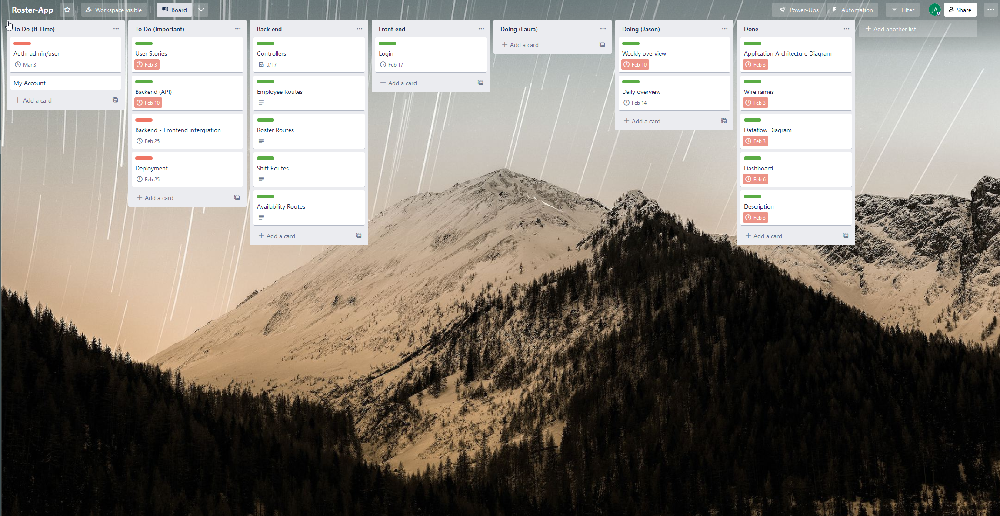
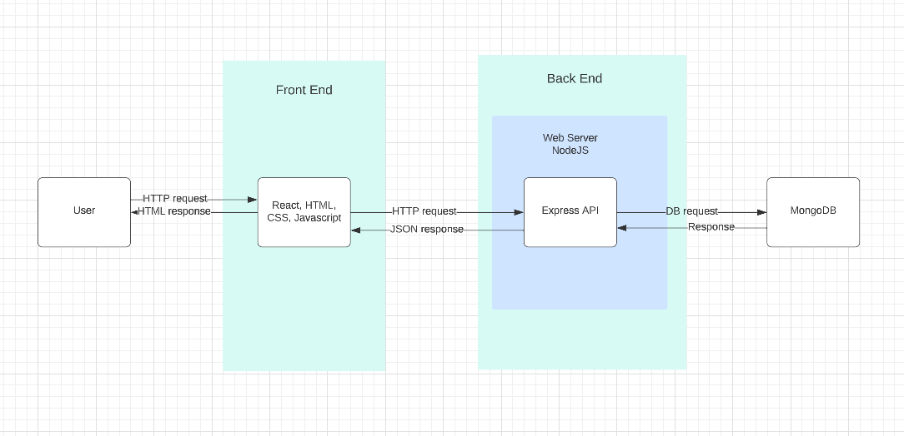
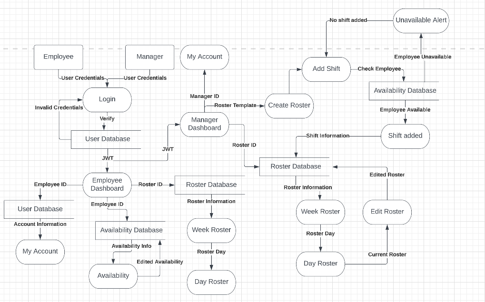
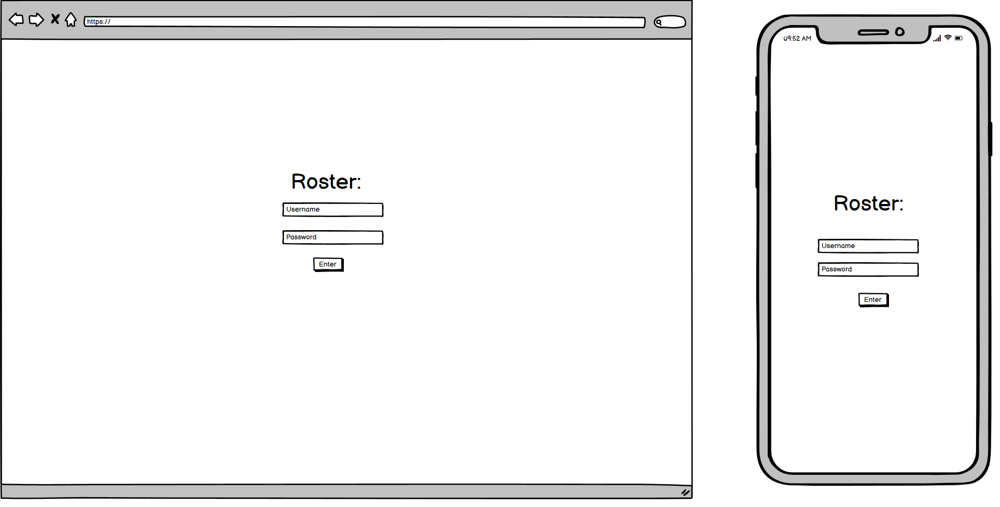
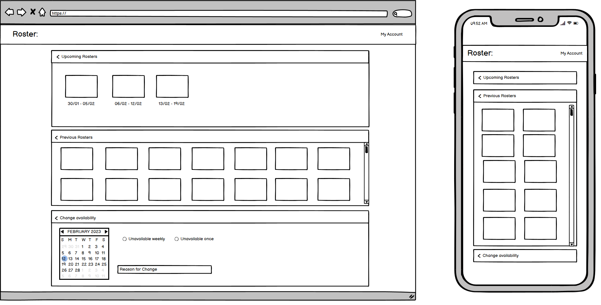
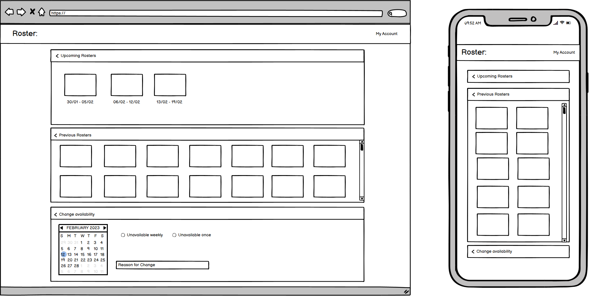
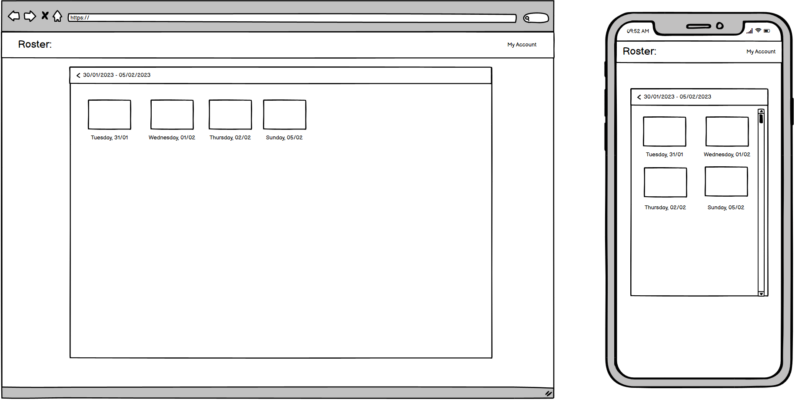
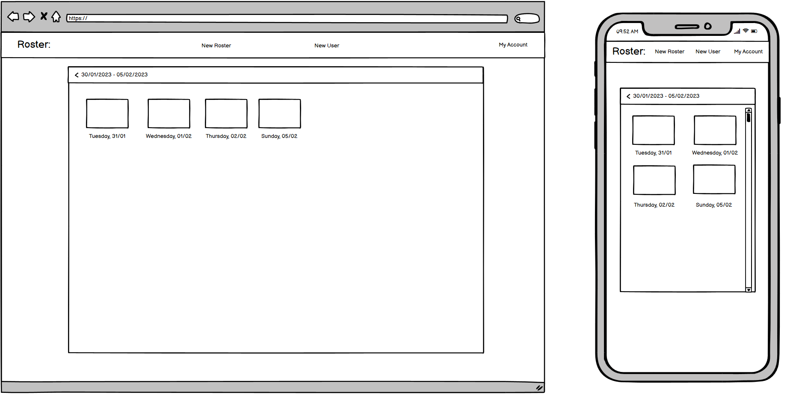
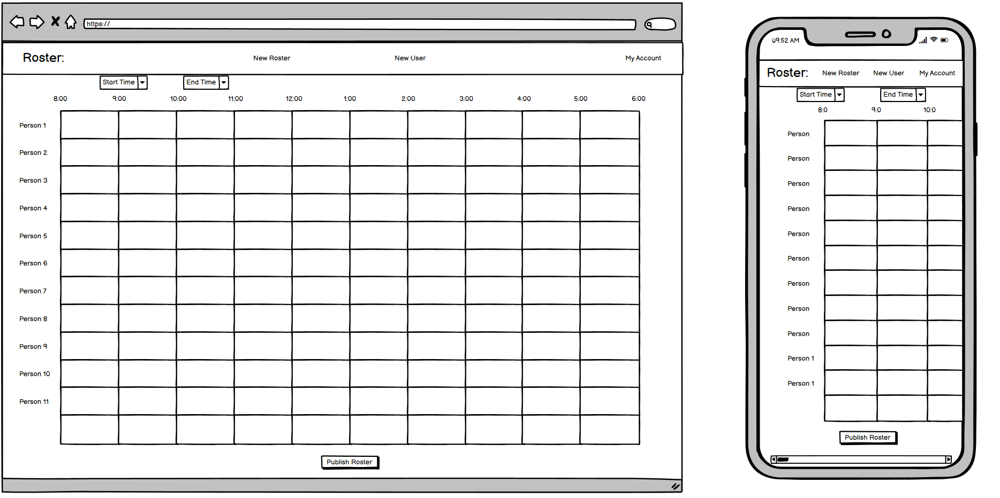
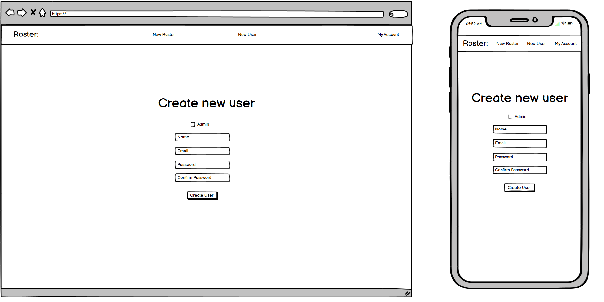

# You can view the deployed product here:
https://main--inspiring-gelato-aae7ec.netlify.app/

and use the login:

email: john@email.com  
password: john1234
# Github

You can view the working repo for the front end here : https://github.com/Reaver113/roster-app  
and the backend repo here: https://github.com/laurajennings/roster-app

# Development:

You can follow our development of this application on Trello:

https://trello.com/b/FvyVnMsZ/roster-app

# Rostr readme

With Rostr, you can simplify your business operations and eliminate the frustration that often comes with complicated and confusing rostering software. Our 20 years of combined experience in the retail industry has shown us that most businesses struggle with the inefficient and time-consuming rostering systems available in the market. So, we created a solution that not only meets the demands of retail and hospitality businesses but also makes their lives easier.

Rostr is designed to be an all-in-one solution for your rostering needs. With its user-friendly interface, you can easily create, assign, edit, and delete time slots with just a few clicks. The software is designed in such a way that you don't need any training or a tech-savvy team to use it. With Rostr, you can easily manage your rosters without the hassle of learning complex software.

The application allows you to create new users and assign them to the desired shifts, ensuring that everyone knows their working hours. Employees can also change their availability if they have upcoming days they can't work. The shifts are displayed in an easy-to-read format, making it convenient for employees to keep track of their working hours.

Rostr is built on a MERN stack (MongoDB, ExpressJS, React, and NodeJS), making it a reliable and secure rostering application for your business.

# Starting Thoughts

When we first started developing Rostr, we created these user stories to help guide the path of our creation:

As a business owner, I want to easily create and assign shifts to my employees, so that I can save time and minimize errors.

As an employee, I want to be able to view my schedule in an easy-to-read format, so that I can stay informed about my working hours.

As a manager, I want to be able to edit and delete shifts as needed, so that I can respond quickly to changing circumstances.

As a team member, I want to be able to update my availability, so that my manager can assign me to shifts that work with my schedule.

As a business owner, I want to have a secure and reliable rostering application, so that I can keep sensitive information protected.

As a new user, I want to be able to use the application without any training, so that I can start using it right away.

As an administrator, I want to be able to create new users and assign them to shifts, so that everyone is accounted for.

# Application Architecture Diagram  

# Dataflow Diagram

# Wireframes

Login screen:

User Dashboard:

Admin Dashbopard:

User Weekly Overview:

Admin Weekly Overview:

Daily User View:

Create New Roster:

Create New User:

# Development:

You can follow our development of this application on Trello:

https://trello.com/b/FvyVnMsZ/roster-app

